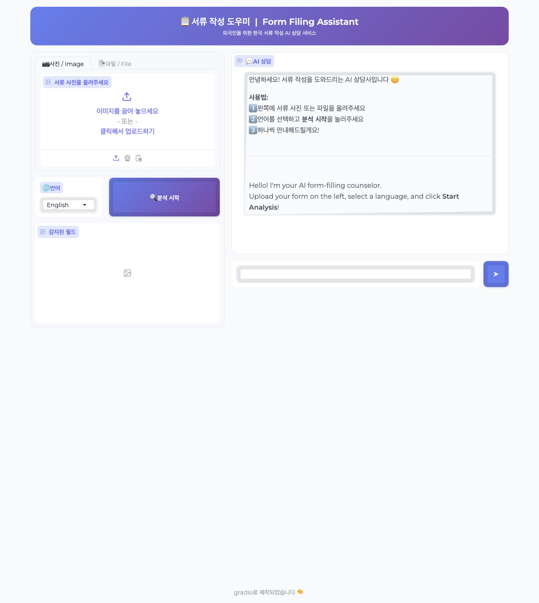
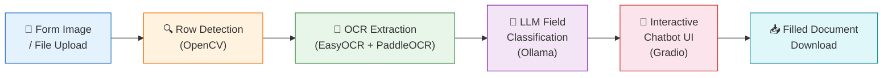
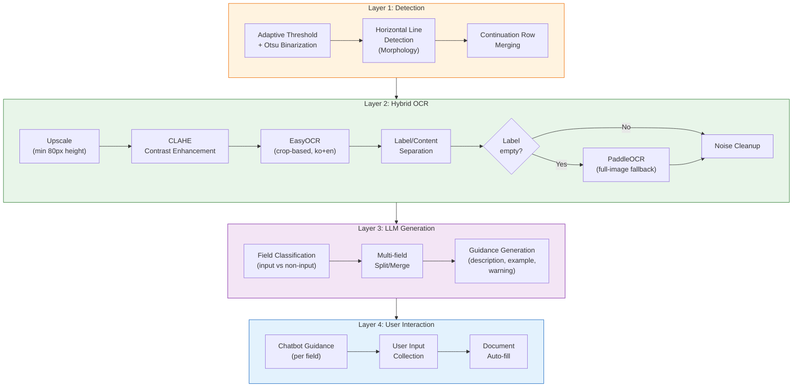
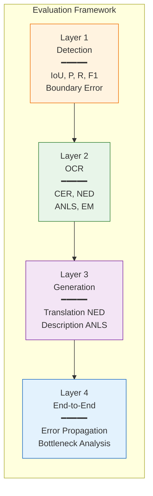
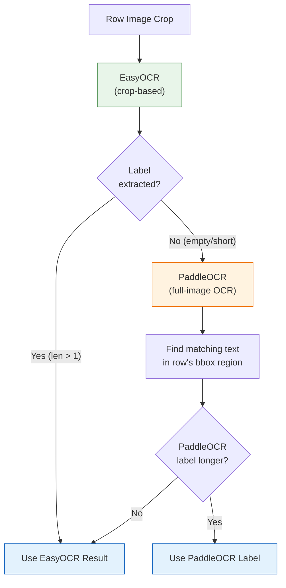

# DocumentDetection - Korean Form Filing Assistant

An AI-powered document analysis system that helps foreigners easily fill out Korean government forms.

Upload a form image or file (PDF, DOCX, HWP, HWPX), and the system automatically detects input fields and provides step-by-step guidance in your preferred language.


## UI



## Features

- **Automatic Field Detection** — OpenCV-based table row detection + OCR + LLM batch classification
- **Hybrid OCR** — EasyOCR (crop-based) + PaddleOCR (full-image fallback) for robust Korean text extraction
- **HWP/HWPX Support** — PrvText cell-structure parsing for HWP, ZIP-based XML extraction for HWPX
- **Multi-document Splitting** — Automatically detects and separates combined forms (신청서+확인서+동의서)
- **Multilingual Guidance** — LLM generates clear instructions for each field from a foreigner's perspective
- **Interactive Input** — Chatbot-style interface guides users through each field one by one
- **Checkbox Support** — Automatic detection of selectable fields with dedicated UI
- **Auto-fill Documents** — Fills user input into the original file for download
- **4 Languages** — Korean, English, Chinese, Vietnamese

---

## System Architecture

> **Figure 1.** Overall system pipeline. The form image goes through four processing stages before reaching the user via an interactive chatbot interface.



> **Figure 2.** Detailed 4-layer processing pipeline with LangGraph orchestration.



### Pipeline Modules

| Stage | Module | Description |
|-------|--------|-------------|
| Preprocessing | `src/node/preprocess.py` | Image resizing, quality correction |
| Row Detection | `src/detector.py` | Horizontal line detection + continuation row merging |
| OCR | `src/ocr.py` | Hybrid EasyOCR + PaddleOCR with preprocessing pipeline |
| Field Classification | `src/node/classify_fields.py` | LLM-based field identification and guidance |
| Rendering | `src/renderer.py` | Annotate detected fields with numbers |
| File Filling | `src/file_filler.py` | Auto-fill user input into DOCX/HWP files |

---

## Evaluation

We adopt a **4-layer evaluation framework** inspired by academic document understanding benchmarks (FUNSD, SROIE, DocVQA). Each layer of the pipeline is evaluated independently, allowing precise identification of performance bottlenecks and error propagation across stages.

> **Figure 3.** Evaluation framework — each pipeline layer is measured with domain-specific metrics before combining into an end-to-end score.



### Why These Metrics?

> **Table 1.** Metric definitions and rationale. Each metric is chosen for a specific reason aligned with the characteristics of Korean government forms.

| Metric | Definition | Why We Use It |
|--------|-----------|---------------|
| **IoU** (Intersection over Union) | Overlap ratio between predicted and ground-truth bounding boxes | Measures how precisely row boundaries are detected — critical for correct crop-based OCR |
| **Precision / Recall / F1** | Standard detection metrics | Precision catches false positives (non-field rows detected as fields); Recall ensures no real field is missed — both matter for user experience |
| **CER** (Character Error Rate) | Edit distance / GT length at character level | Directly measures OCR accuracy — even one wrong character in a field name (e.g., `면허` → `면히`) can confuse users |
| **NED** (Normalized Edit Distance) | 1 - (edit distance / max length) | Scale-invariant version of CER, comparable across fields of different lengths |
| **ANLS** (Average Normalized Levenshtein Similarity) | NED with a 0.5 threshold cutoff | The primary OCR metric from DocVQA/SROIE benchmarks — penalizes severely wrong predictions (NED < 0.5 → score 0) while being tolerant of minor errors |
| **Exact Match** | Binary: predicted text == ground truth | Strictest metric — reveals how many fields are perfectly recognized with zero errors |
| **Translation NED** | NED between predicted and expected field name translations | Ensures LLM translations are accurate (e.g., `성명` → "Full Name" not "First Name") |
| **Description ANLS** | ANLS between generated and reference descriptions | Measures quality of user-facing guidance text — the final output users actually see |

### Reference Benchmarks

| Layer | Metrics | Academic Reference |
|-------|---------|-------------------|
| Detection | IoU, Precision, Recall, F1 | FUNSD (ICDAR 2019), PubLayNet (CVPR 2019) |
| OCR | CER, NED, ANLS, Exact Match | SROIE (ICDAR 2019), IC15 (ICDAR 2015) |
| Generation | Translation NED, Description ANLS | DocVQA (WACV 2021), G-Eval (NeurIPS 2023) |
| End-to-End | Error Propagation, Bottleneck | FUNSD, CORD (CLOVA AI) |

### Test Forms

| Form | Fields | Characteristics |
|------|:------:|----------------|
| **Simple Form** | 7 | Single-row fields only (name, nationality, passport no., etc.) |
| **Complex Form** | 10 | Multi-row merged fields, checkbox groups, table-style layouts, signature fields |

### Results

> **Table 2.** End-to-end performance across all 4 layers. Hybrid OCR (EasyOCR + PaddleOCR fallback) is used for text extraction.

| Metric | Simple Form (7 fields) | Complex Form (10 fields) |
|--------|:----------------------:|:------------------------:|
| **Detection** | | |
| Precision | **1.000** | 0.833 |
| Recall | **1.000** | **1.000** |
| F1 | **1.000** | 0.909 |
| Mean IoU | 0.875 | **1.000** |
| **OCR** | | |
| CER | **0.000** | 0.060 |
| NED | **1.000** | 0.940 |
| ANLS | **1.000** | 0.940 |
| Exact Match | **1.000** | 0.700 |
| **LLM Generation** | | |
| Translation NED | 0.849 | 0.793 |
| KO Label Accuracy | **1.000** | 0.700 |
| Description ANLS | 0.505 | 0.253 |
| JSON Parse Success | **1.000** | **1.000** |
| **End-to-End** | | |
| **E2E Success** | **1.000** | **0.940** |
| Bottleneck | detection | ocr |
| Latency / field | 4.4s | 4.2s |

### OCR Error Analysis

> **Table 3.** Per-field OCR results on the Complex Form. 7 out of 10 fields achieve perfect recognition. The remaining 3 errors are caused by EasyOCR limitations on visually similar Korean characters and special characters.

| Field (GT) | OCR Result | CER | Error Type |
|-----------|-----------|:---:|-----------|
| 성명 | 성명 | 0.00 | - |
| 주소 | 주소 | 0.00 | - |
| 연락처 | 연락처 | 0.00 | - |
| 학교명 | 학교명 | 0.00 | - |
| 희망직무 | 희망직무 | 0.00 | - |
| 희망지역 | 희망지역 | 0.00 | - |
| 일경험 참여이력 | 일경험참여이력 | 0.12 | Space loss in compound noun |
| 자격/면허 | 자격면히 | 0.40 | Slash dropped + `허`→`히` similar glyph |
| 개인정보 제공 동의 여부 | 개인정보 제급 동의 여부 | 0.08 | `제공`→`제급` similar glyph |
| 신청인 | 신청인 | 0.00 | - |

### Hybrid OCR Strategy

> **Figure 4.** OCR engine selection logic. EasyOCR is the primary engine for cropped row images due to its strong performance on small regions. PaddleOCR serves as a full-image fallback when EasyOCR fails to extract a label.



**Why hybrid?** EasyOCR excels at crop-based OCR (small row images with preprocessing) but occasionally returns empty labels for certain field layouts. PaddleOCR performs well on full-page images but struggles with small cropped regions (45–55px height). Combining both engines compensates for each other's weaknesses.

### Reproduce

```bash
# Metric unit tests
python -m eval.run_eval --mode unit

# Simple form (7 fields)
python -m eval.run_eval --mode e2e --gt eval/ground_truth/synth_form_01.json --lang en

# Complex form (10 fields)
python -m eval.run_eval --mode e2e --gt eval/ground_truth/complex_form.json --lang en
```

---

## Installation

### Prerequisites

- Python 3.9+
- [Ollama](https://ollama.ai/) (Local LLM server)

### 1. Clone and Setup

```bash
git clone https://github.com/rriakang/DocumentDetection.git
cd DocumentDetection

python -m venv .venv
source .venv/bin/activate  # Windows: .venv\Scripts\activate
pip install -r requirements.txt
```

### 2. Install and Run Ollama Models

```bash
# Download models
ollama pull qwen3-vl:8b   # Vision-Language model (image analysis)
ollama pull qwen3:8b       # Text model (field classification & guidance)

# Start server
ollama serve
```

### 3. Run the App

```bash
python app.py
```

Open `http://localhost:7860` in your browser.

### Environment Variables (Optional)

| Variable | Default | Description |
|----------|---------|-------------|
| `OLLAMA_URL` | `http://localhost:11434` | Ollama server URL |
| `OLLAMA_VLM_MODEL` | `qwen3-vl:8b` | Vision model |
| `OLLAMA_TEXT_MODEL` | `qwen3:8b` | Text model |
| `OLLAMA_TIMEOUT` | `300` | Request timeout (seconds) |

---

## Usage

1. Upload a **form image** or **file** (PDF, DOCX, HWP, HWPX) on the left panel
2. Select your **language** (English, Chinese, Vietnamese, Korean)
3. Click **Start Analysis**
4. The chatbot guides you through each field — type your answers
5. After all fields are completed, view the summary + **download the filled document**

---

## Project Structure

```
DocumentDetection/
├── app.py                  # Gradio main app
├── requirements.txt
├── src/
│   ├── config.py           # Configuration (models, image sizes)
│   ├── detector.py         # OpenCV row detection + continuation merging
│   ├── ocr.py              # Hybrid OCR (EasyOCR + PaddleOCR fallback)
│   ├── llm_client.py       # Ollama API client
│   ├── prompts.py          # LLM prompt templates
│   ├── graph.py            # LangGraph pipeline definition
│   ├── state.py            # Pipeline state definition
│   ├── file_extractor.py   # PDF/DOCX/HWP text extraction
│   ├── file_filler.py      # Auto-fill user input into files
│   ├── renderer.py         # Annotate images with field numbers
│   ├── utils.py            # Utility functions
│   └── node/               # LangGraph nodes
│       ├── preprocess.py
│       ├── detect_boxes.py
│       ├── classify_fields.py
│       ├── generate_guidance.py
│       ├── draw_boxes.py
│       └── finalize.py
└── eval/
    ├── run_eval.py          # Evaluation runner
    ├── metrics.py           # Evaluation metrics (IoU, CER, ANLS, etc.)
    ├── ground_truth/        # Ground truth data
    └── images/              # Test images
```

## Tech Stack

- **UI**: Gradio 4.44
- **Pipeline**: LangGraph
- **Row Detection**: OpenCV (Adaptive Threshold + Morphology)
- **OCR**: EasyOCR (crop-based) + PaddleOCR (full-image fallback)
- **LLM**: Ollama (qwen3-vl:8b, qwen3:8b)
- **File Processing**: pdfplumber, python-docx, olefile (HWP)
