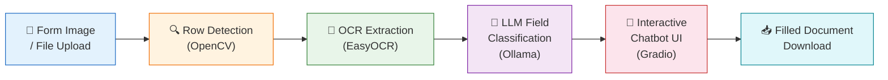
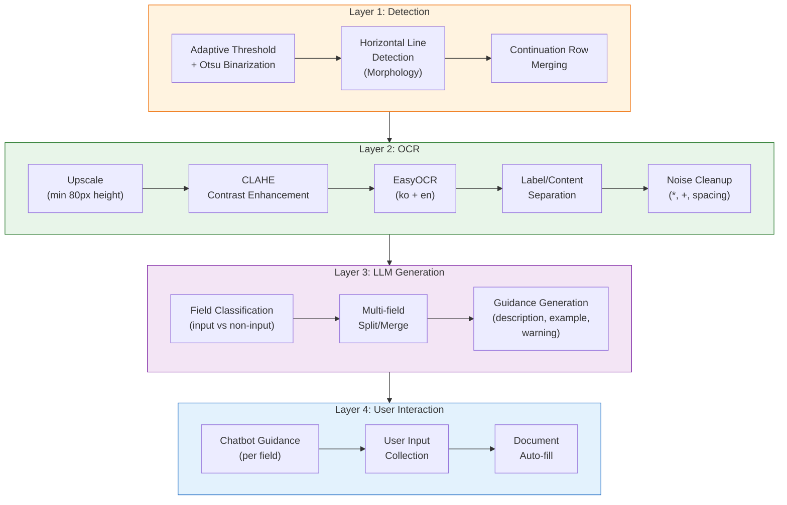
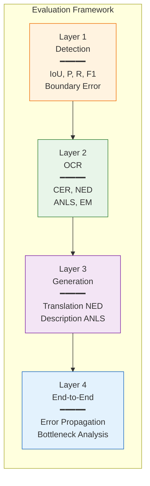

# DocumentDetection - Korean Form Filing Assistant

An AI-powered document analysis system that helps foreigners easily fill out Korean government forms.

Upload a form image or file (PDF, DOCX, HWP), and the system automatically detects input fields and provides step-by-step guidance in your preferred language.


## Features

- **Automatic Field Detection** — OpenCV-based table row detection with continuation row merging
- **OCR Text Extraction** — EasyOCR Korean/English recognition with noise post-processing
- **Multilingual Guidance** — LLM generates clear instructions for each field from a foreigner's perspective
- **Interactive Input** — Chatbot-style interface guides users through each field one by one
- **Checkbox Support** — Automatic detection of selectable fields with dedicated UI
- **Auto-fill Documents** — Fills user input into the original file for download
- **4 Languages** — Korean, English, Chinese, Vietnamese

---

## System Architecture

> **Figure 1.** Overall system pipeline. The form image goes through four processing stages before reaching the user via an interactive chatbot interface.



> **Figure 2.** Detailed 4-layer processing pipeline with LangGraph orchestration.



### Pipeline Modules

| Stage | Module | Description |
|-------|--------|-------------|
| Preprocessing | `src/node/preprocess.py` | Image resizing, quality correction |
| Row Detection | `src/detector.py` | Horizontal line detection + continuation row merging |
| OCR | `src/ocr.py` | EasyOCR + upscale + CLAHE + noise cleanup |
| Field Classification | `src/node/classify_fields.py` | LLM-based field identification and guidance |
| Rendering | `src/renderer.py` | Annotate detected fields with numbers |
| File Filling | `src/file_filler.py` | Auto-fill user input into DOCX/HWP files |

---

## Evaluation

> **Figure 3.** Evaluation framework with 4-layer metrics, based on academic document understanding benchmarks.



### Reference Benchmarks

| Layer | Metrics | Reference |
|-------|---------|-----------|
| Detection | IoU, Precision, Recall, F1 | FUNSD (ICDAR 2019), PubLayNet |
| OCR | CER, NED, ANLS, Exact Match | SROIE (ICDAR 2019), IC15 |
| Generation | Translation NED, Description ANLS | DocVQA (WACV 2021), G-Eval |
| E2E | Error Propagation, Bottleneck | FUNSD, CORD |

### Current Performance

> **Table 1.** End-to-end performance on two test forms. Simple Form has 7 fields (single-row). Complex Form has 10 fields including checkboxes, multi-row fields, and table-style layouts.

| Metric | Simple Form (7 fields) | Complex Form (10 fields) |
|--------|:----------------------:|:------------------------:|
| Detection F1 | **1.000** | 0.909 |
| Detection Recall | **1.000** | **1.000** |
| OCR ANLS | **1.000** | 0.940 |
| OCR Exact Match | **1.000** | 0.700 |
| LLM JSON Success | **1.000** | **1.000** |
| **E2E Success** | **1.000** | **0.940** |
| Latency/field | 5.1s | 4.5s |

```bash
# Reproduce evaluation results
python -m eval.run_eval --mode unit                                                    # metric unit tests
python -m eval.run_eval --mode e2e --gt eval/ground_truth/synth_form_01.json --lang en # simple form
python -m eval.run_eval --mode e2e --gt eval/ground_truth/complex_form.json --lang en  # complex form
```

---

## Installation

### Prerequisites

- Python 3.11+
- [Ollama](https://ollama.ai/) (Local LLM server)

### 1. Clone and Setup

```bash
git clone https://github.com/rriakang/DocumentDetection.git
cd DocumentDetection

python -m venv .venv
source .venv/bin/activate  # Windows: .venv\Scripts\activate
pip install -r requirements.txt
```

### 2. Install and Run Ollama Models

```bash
# Download models
ollama pull qwen3-vl:8b   # Vision-Language model (image analysis)
ollama pull qwen3:8b       # Text model (field classification & guidance)

# Start server
ollama serve
```

### 3. Run the App

```bash
python app.py
```

Open `http://localhost:7860` in your browser.

### Environment Variables (Optional)

| Variable | Default | Description |
|----------|---------|-------------|
| `OLLAMA_URL` | `http://localhost:11434` | Ollama server URL |
| `OLLAMA_VLM_MODEL` | `qwen3-vl:8b` | Vision model |
| `OLLAMA_TEXT_MODEL` | `qwen3:8b` | Text model |
| `OLLAMA_TIMEOUT` | `180` | Request timeout (seconds) |

---

## Usage

1. Upload a **form image** or **file** (PDF, DOCX, HWP, HWPX) on the left panel
2. Select your **language** (English, Chinese, Vietnamese, Korean)
3. Click **Start Analysis**
4. The chatbot guides you through each field — type your answers
5. After all fields are completed, view the summary + **download the filled document**

---

## Project Structure

```
DocumentDetection/
├── app.py                  # Gradio main app
├── requirements.txt
├── src/
│   ├── config.py           # Configuration (models, image sizes)
│   ├── detector.py         # OpenCV row detection + continuation merging
│   ├── ocr.py              # EasyOCR text extraction + post-processing
│   ├── llm_client.py       # Ollama API client
│   ├── prompts.py          # LLM prompt templates
│   ├── graph.py            # LangGraph pipeline definition
│   ├── state.py            # Pipeline state definition
│   ├── file_extractor.py   # PDF/DOCX/HWP text extraction
│   ├── file_filler.py      # Auto-fill user input into files
│   ├── renderer.py         # Annotate images with field numbers
│   ├── utils.py            # Utility functions
│   └── node/               # LangGraph nodes
│       ├── preprocess.py
│       ├── detect_boxes.py
│       ├── classify_fields.py
│       ├── generate_guidance.py
│       ├── draw_boxes.py
│       └── finalize.py
└── eval/
    ├── run_eval.py          # Evaluation runner
    ├── metrics.py           # Evaluation metrics (IoU, CER, ANLS, etc.)
    ├── ground_truth/        # Ground truth data
    └── images/              # Test images
```

## Tech Stack

- **UI**: Gradio 5.0
- **Pipeline**: LangGraph
- **Row Detection**: OpenCV (Adaptive Threshold + Morphology)
- **OCR**: EasyOCR (Korean / English)
- **LLM**: Ollama (qwen3-vl:8b, qwen3:8b)
- **File Processing**: pdfplumber, python-docx
