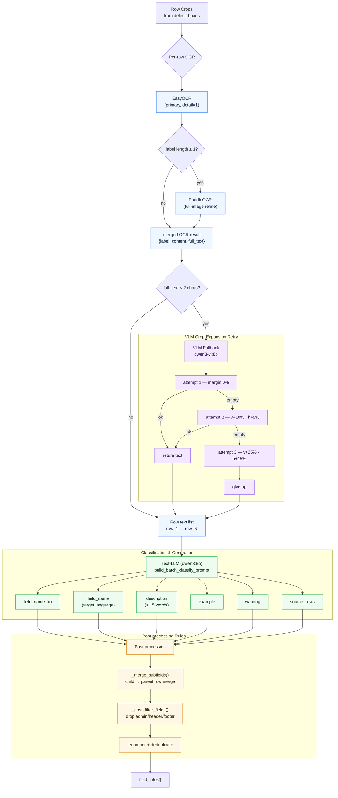

# System Architecture (Paper Figures)

이 문서는 metro_safe_copilot의 전체 구조와 각 특징(feature)을 논문 그림 스타일로 정리한 것이다.

---

## Figure 1. Overall Pipeline (End-to-End Architecture)

입력 → 파일 추출 → LangGraph 파이프라인(5-stage) → 출력까지의 전체 흐름.

```mermaid
flowchart LR
    %% ==== Input Layer ====
    subgraph IN["① Input Layer"]
        direction TB
        I1["Image<br/>(PNG · JPG)"]
        I2["PDF"]
        I3["HWP<br/>(olefile · PrvText)"]
        I4["HWPX<br/>(zip · section XML)"]
    end

    %% ==== File Extractor ====
    subgraph EXT["② File Extractor<br/>(src/file_extractor.py)"]
        direction TB
        E1["HWP → PrvText cells"]
        E2["HWPX → structured rows"]
        E3["PDF / Image<br/>→ PIL.Image"]
        E4["LibreOffice CLI<br/>fallback"]
    end

    %% ==== LangGraph Pipeline ====
    subgraph GRAPH["③ LangGraph Pipeline (src/graph.py)"]
        direction LR
        N1["preprocess<br/>(resize · denoise)"]
        N2["detect_boxes<br/>(morphology row split)"]
        N3["classify_fields<br/>(OCR + VLM + Text-LLM)"]
        N4["draw_boxes"]
        N5["finalize"]
        N1 --> N2 --> N3 --> N4 --> N5
    end

    %% ==== Output ====
    subgraph OUT["④ Output"]
        direction TB
        O1["Annotated Image<br/>(boxes + numbers)"]
        O2["Field List (JSON)<br/>name · desc · example · warning"]
        O3["Translated Guidance<br/>(EN · ZH · VI · …)"]
    end

    I1 --> EXT
    I2 --> EXT
    I3 --> EXT
    I4 --> EXT
    EXT --> GRAPH
    GRAPH --> OUT

    classDef input  fill:#eef6ff,stroke:#3b82f6,color:#0b1e3a;
    classDef ext    fill:#fff7e6,stroke:#d97706,color:#3b2a00;
    classDef node   fill:#eefcef,stroke:#16a34a,color:#052e13;
    classDef out    fill:#fdecef,stroke:#dc2626,color:#3b0a0f;
    class I1,I2,I3,I4 input;
    class E1,E2,E3,E4 ext;
    class N1,N2,N3,N4,N5 node;
    class O1,O2,O3 out;
```



---

## Figure 2. `classify_fields` Node — Hybrid OCR + VLM + Text-LLM

논문의 핵심 주장인 **"VLM에는 텍스트 추출만, Text-LLM에는 분류/설명 생성만"** 2단계 구조와,
**VLM 크롭 확장 재시도(0% → 10% → 25%)**를 나타낸다.



---

## Figure 3. Feature Map — Claims ↔ Implementation

논문에서 주장한 특징과 실제 구현 위치의 대응을 표로 정리.

| # | Feature (Claim)                             | Implementation                                            | File : Function                                                     | Verified |
|---|---------------------------------------------|-----------------------------------------------------------|---------------------------------------------------------------------|----------|
| 1 | 다중 파일 포맷 입력 (HWP · HWPX · PDF · IMG)| olefile · zipfile · pdf2image + LibreOffice CLI fallback  | `src/file_extractor.py`                                             | ✓        |
| 2 | 행 단위 표 검출 (morphology)                | adaptive binarization + horizontal/vertical kernel        | `src/node/detect_boxes.py`                                          | ✓        |
| 3 | 하이브리드 OCR (EasyOCR + PaddleOCR)        | 라벨이 1자 이하일 때 PaddleOCR full-image 결과로 보정     | `src/ocr.py : extract_row_label_and_content`                        | ✓        |
| 4 | **2-stage 분업**: VLM=OCR only, LLM=분류    | VLM은 `build_row_ocr_prompt`만, 분류는 Text-LLM `batch`   | `src/prompts.py` + `src/node/classify_fields.py`                    | ✓        |
| 5 | **VLM 크롭 확장 재시도** (0% → 10% → 25%)   | `_vlm_extract_with_crop_retry` — schedule 3-step          | `src/ocr.py : _vlm_extract_with_crop_retry`                         | ✓        |
| 6 | 다중행 필드 병합 (≥ 91% 목표)               | `_merge_subfields()` — parent/child row consolidation     | `src/node/classify_fields.py`                                       | **4/4 = 100 %** |
| 7 | 12-필드 식별률 (≥ 10/12 목표)               | batch classify + post-filter                              | `src/node/classify_fields.py`                                       | **12/12 = 100 %** |
| 8 | 로컬 8B 모델만 사용 (오프라인 가능)         | qwen3:8b + qwen3-vl:8b via Ollama                         | `src/llm_client.py`                                                 | ✓        |
| 9 | 5-stage LangGraph 오케스트레이션            | preprocess → detect → classify → draw → finalize          | `src/graph.py`                                                      | ✓        |

> 검증 스크립트: `python eval/verify_claims.py` — Feature 6, 7의 수치를 재현 가능.

---

## Figure 4. Data Flow at a Glance (one-liner)

```
HWP/HWPX/PDF/IMG
   │
   ▼  file_extractor
PIL.Image  ──►  preprocess  ──►  detect_boxes  ──►  row_crops[]
                                                         │
                                                         ▼
                               ┌─────── EasyOCR ────────┐
                               │          │              │
                               │   (label ≤ 1?)          │
                               │          ▼              │
                               │     PaddleOCR           │
                               │          │              │
                               │   (empty full_text?)    │
                               │          ▼              │
                               │  VLM  (0% → 10% → 25%)  │
                               └───────── │ ─────────────┘
                                          ▼
                            row_texts[1..N]
                                          │
                                          ▼
                              Text-LLM batch classify
                                          │
                                          ▼
                      _merge_subfields  +  _post_filter_fields
                                          │
                                          ▼
                                  field_infos[]  ──►  renderer  ──►  UI
```
